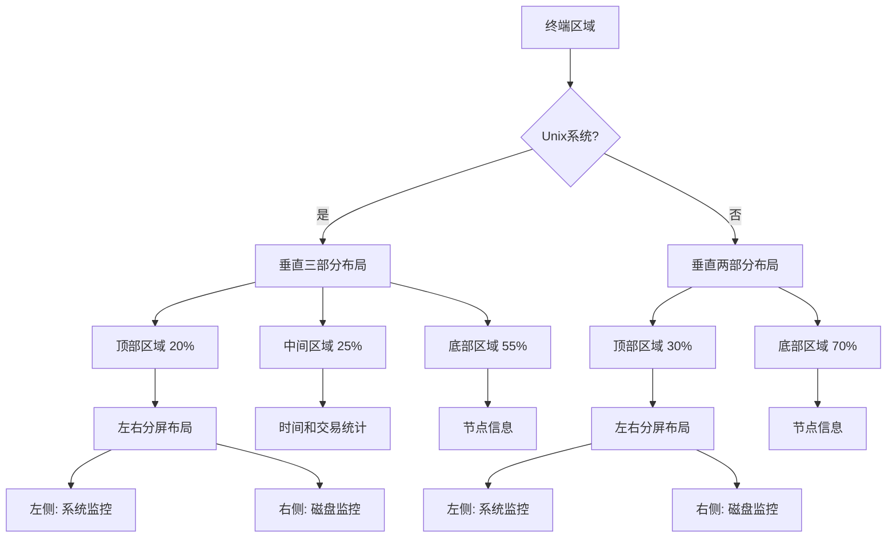

# 磁盘监控UI优化设计文档

## 概述
本设计文档描述如何将现有的系统监控UI从垂直堆叠布局改为左右分屏布局。左侧显示系统监控（CPU、内存、网络），右侧显示磁盘挂载详情。目标是消除现有的"智能显示模式"补丁，提供更清晰、更一致的用户体验。

## 架构

### 当前架构分析
当前架构使用tui-rs框架，布局层次如下：
1. **顶层布局**：根据Unix/非Unix系统使用不同的垂直分割
2. **SystemWidget**：负责渲染系统信息和磁盘信息
3. **智能显示模式**：根据终端高度决定显示内容（高度≥8行显示详情，否则只显示摘要）

### 新架构设计
新架构将采用以下变化：
1. **布局重构**：在Unix系统的顶部区域（当前占20%）改为左右分屏
2. **组件分离**：将SystemWidget拆分为两个逻辑组件（系统监控和磁盘监控）
3. **消除补丁**：移除高度相关的显示模式切换逻辑



## 组件和接口

### 1. 布局组件修改

#### draw.rs 修改
```rust
// 当前代码（Unix系统）：
let vertical_chunks = Layout::default()
    .direction(Direction::Vertical)
    .constraints([
        Constraint::Percentage(20),  // 系统监控区域
        Constraint::Percentage(25),  // 时间和交易统计
        Constraint::Percentage(55),  // 节点信息
    ].as_ref())
    .split(area);

// 新设计：
let vertical_chunks = Layout::default()
    .direction(Direction::Vertical)
    .constraints([
        Constraint::Percentage(20),  // 系统+磁盘监控区域
        Constraint::Percentage(25),  // 时间和交易统计
        Constraint::Percentage(55),  // 节点信息
    ].as_ref())
    .split(area);

// 在顶部区域内创建左右分屏
let system_disk_chunks = Layout::default()
    .direction(Direction::Horizontal)
    .constraints([
        Constraint::Percentage(50),  // 左侧：系统监控
        Constraint::Percentage(50),  // 右侧：磁盘监控
    ].as_ref())
    .split(vertical_chunks[0]);
```

#### SystemWidget 重构
当前SystemWidget需要拆分为两个渲染逻辑：
1. **系统监控渲染**：只渲染CPU、内存、网络信息
2. **磁盘监控渲染**：渲染所有磁盘挂载点列表

### 2. 新组件设计

#### SystemSummaryWidget（新组件）
负责渲染系统监控摘要信息：
- CPU使用率
- 内存使用情况
- 网络统计
- 系统运行时间

#### DiskListWidget（新组件）
负责渲染磁盘挂载点列表：
- 所有监控的磁盘挂载点
- 类似`df -h`的表格格式
- 支持Tab键导航
- 颜色编码（告警、网络文件系统）

### 3. 接口设计

#### 数据接口
保持现有的`SystemStats`数据结构不变：
```rust
#[derive(Debug, Clone)]
pub struct SystemStats {
    // 系统信息字段保持不变
    pub cpu_usage: f32,
    pub memory_usage_percent: f32,
    pub memory_used: u64,
    pub memory_total: u64,
    pub disk_usage_percent: f32,
    pub disk_used: u64,
    pub disk_total: u64,
    pub network_rx: u64,
    pub network_tx: u64,
    pub uptime: u64,

    // 磁盘信息字段保持不变
    pub disk_details: Vec<DiskDetail>,
    pub current_disk_index: usize,
    pub alert_threshold: f32,
    pub has_disk_alerts: bool,
    pub auto_discovery_enabled: bool,
}
```

#### 组件接口
```rust
// SystemSummaryWidget 接口
impl Widget for &SystemSummaryWidget {
    fn render(self, area: Rect, buf: &mut Buffer) {
        // 渲染系统监控摘要
    }
}

// DiskListWidget 接口
impl Widget for &DiskListWidget {
    fn render(self, area: Rect, buf: &mut Buffer) {
        // 渲染磁盘列表
    }
}
```

## 数据模型

### 现有数据模型分析
当前数据模型设计良好，无需修改：
- `SystemStats`：包含所有系统监控数据
- `DiskDetail`：包含单个磁盘挂载点的详细信息
- 数据流向：collector → SystemStats → Widgets → UI渲染

### 数据流优化
1. **数据收集**：保持不变，collector定期更新SystemStats
2. **数据传递**：SystemStats通过SharedData传递给widgets
3. **UI渲染**：
   - SystemSummaryWidget读取系统相关字段
   - DiskListWidget读取disk_details和相关字段

## 错误处理

### 布局错误处理
1. **终端尺寸过小**：
   - 当宽度不足时：保持左右分屏但压缩内容
   - 当高度不足时：启用垂直滚动或显示简化视图
   - 最小尺寸：宽度≥40字符，高度≥6行

2. **磁盘数据为空**：
   - 显示"未发现磁盘挂载点"消息
   - 提供配置提示（检查--disk-mount-points参数）

### 渲染错误处理
1. **数据格式错误**：
   - 使用默认值或占位符
   - 记录错误但不中断UI渲染

2. **颜色编码错误**：
   - 使用默认颜色（灰色）
   - 确保颜色编码不影响可读性

## 测试策略

### 单元测试
1. **布局计算测试**：
   - 测试不同终端尺寸下的布局分割
   - 测试最小尺寸边界条件
   - 测试Unix/非Unix系统布局差异

2. **组件渲染测试**：
   - 测试SystemSummaryWidget渲染逻辑
   - 测试DiskListWidget渲染逻辑
   - 测试颜色编码逻辑

### 集成测试
1. **UI集成测试**：
   - 测试完整的UI渲染流程
   - 测试Tab键导航功能
   - 测试数据更新刷新

2. **终端尺寸测试**：
   - 测试不同终端尺寸下的UI表现
   - 测试布局自适应能力

### 手动测试场景
1. **正常场景**：
   - 终端尺寸充足（≥80x24）
   - 多个磁盘挂载点
   - 正常数据更新

2. **边界场景**：
   - 终端尺寸最小（40x6）
   - 单个磁盘挂载点
   - 无磁盘挂载点
   - 网络文件系统
   - 磁盘使用率超过阈值

## 设计决策和理由

### 决策1：保持现有数据结构不变
**理由**：遵循"Never break userspace"原则。现有数据收集逻辑工作正常，修改数据结构会破坏向后兼容性。

### 决策2：在现有布局内部分屏
**理由**：最小化改动范围。只在SystemWidget当前占用的区域内进行分屏，不影响其他UI组件。

### 决策3：移除智能显示模式
**理由**：消除补丁逻辑。智能显示模式是为了解决UI空间不足的临时方案，左右分屏提供了永久解决方案。

### 决策4：保持Tab键导航
**理由**：保持现有功能。Tab键导航在磁盘列表中有用，可以高亮当前选中的磁盘。

### 决策5：使用50/50分屏比例
**理由**：平衡信息密度。系统监控和磁盘监控同等重要，各占50%空间提供良好的视觉平衡。

## 兼容性考虑

### 向后兼容性
1. **命令行参数**：所有现有参数保持功能不变
2. **配置文件**：现有配置无需修改
3. **数据接口**：SystemStats数据结构保持不变
4. **UI行为**：Tab键导航、颜色编码、告警逻辑保持不变

### 向前兼容性
1. **扩展性**：新架构便于添加更多监控指标
2. **可维护性**：分离的组件更易于测试和维护
3. **性能**：渲染逻辑优化，减少条件判断

## 实施优先级

### 高优先级
1. 修改draw.rs中的布局逻辑
2. 重构SystemWidget为两个组件
3. 实现基本的左右分屏渲染

### 中优先级
1. 优化磁盘列表渲染（多行显示）
2. 实现Tab键导航高亮
3. 添加适当的错误处理

### 低优先级
1. 添加更多UI美化（分隔线、标题等）
2. 优化小尺寸终端的显示
3. 添加性能监控和优化