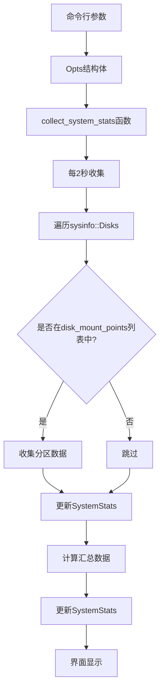

# 多挂载点磁盘监控设计文档

## 概述
本设计将磁盘监控从硬编码的 `/opt` 和 `/` 分区扩展为可配置的多分区监控。核心改进是消除特殊情况，用配置驱动替代硬编码逻辑。

## 架构

### 当前架构问题
```rust
// 坏品味：重复的if分支
if mount_point == "/opt" {
    disk_total += disk.total_space();
    disk_available += disk.available_space();
} else if mount_point == "/" {
    disk_total += disk.total_space();
    disk_available += disk.available_space();
}
```

### 新架构设计
```
应用启动
    ↓
解析命令行参数
    ↓
验证挂载点参数
    ↓
每2秒收集数据
    ├── 遍历所有磁盘
    ├── 过滤命令行指定的挂载点
    ├── 计算汇总数据
    └── 更新共享状态
        ↓
界面显示
    ├── 汇总视图（默认）
    └── 详细视图（可选）
```

## 组件和接口

### 1. 命令行参数管理
**命令行参数**:
```bash
./chaindash --disk-mount-points /,/opt,/data,/mnt/blockchain
```

**参数解析** (更新 src/opts.rs):
```rust
use clap::Parser;
use num_rational::Ratio;

#[derive(Parser, Debug)]
pub struct Opts {
    /// The platon connection endpoints, separated by `,`.
    #[arg(long, default_value = "test@http://127.0.0.1:6789")]
    pub url: String,

    /// Render interval
    #[arg(long, default_value = "1")]
    pub interval: Ratio<u64>,

    /// Enable docker stats
    #[arg(long)]
    pub enable_docker_stats: bool,

    /// Docker service port
    #[arg(long, default_value = "2375")]
    pub docker_port: u16,

    /// Enable debug log
    #[arg(long)]
    pub debug: bool,

    /// Disk mount points to monitor (comma-separated)
    #[arg(long, value_delimiter = ',', default_value = "/,/opt")]
    pub disk_mount_points: Vec<String>,
}
```

### 2. 数据结构优化
**当前结构** (需要优化):
```rust
pub struct SystemStats {
    pub disk_used: u64,          // 冗余：可计算得出
    pub disk_total: u64,
    pub disk_available: u64,     // 冗余：disk_total - disk_used
    pub disk_usage_percent: f32,
}
```

**优化后结构**:
```rust
pub struct SystemStats {
    pub disk_total: u64,
    pub disk_used: u64,
    // 移除 disk_available，按需计算
    pub disk_usage_percent: f32,
    // 新增：每个分区的详细信息
    pub disk_details: Vec<DiskDetail>,
}

#[derive(Debug, Clone)]
pub struct DiskDetail {
    pub mount_point: String,
    pub total: u64,
    pub used: u64,
    pub usage_percent: f32,
}
```

### 3. 数据收集接口
```rust
// 在 collector.rs 中修改 collect_system_stats 函数
fn collect_system_stats(opts: &Opts) -> SystemStats {
    // ... 其他系统数据收集

    // 磁盘数据收集
    let disks = Disks::new_with_refreshed_list();
    let mut disk_total: u64 = 0;
    let mut disk_used: u64 = 0;
    let mut disk_details = Vec::new();

    for disk in disks.list() {
        let mount_point = disk.mount_point().to_string_lossy();

        // 使用命令行参数过滤
        if opts.disk_mount_points.contains(&mount_point.to_string()) {
            let total = disk.total_space();
            let available = disk.available_space();
            let used = total.saturating_sub(available);
            let usage_percent = if total > 0 {
                (used as f32 / total as f32) * 100.0
            } else {
                0.0
            };

            disk_details.push(DiskDetail {
                mount_point: mount_point.to_string(),
                total,
                used,
                usage_percent,
            });

            disk_total = disk_total.saturating_add(total);
            disk_used = disk_used.saturating_add(used);
        }
    }

    let disk_usage_percent = if disk_total > 0 {
        (disk_used as f32 / disk_total as f32) * 100.0
    } else {
        0.0
    };

    SystemStats {
        // ... 其他字段
        disk_total,
        disk_used,
        disk_usage_percent,
        disk_details,
    }
}
```

### 4. 界面显示接口
**汇总视图** (保持现有):
```rust
// 显示: 💾 45.2% | 128.5GB / 284.3GB
format!("\u{f1c0} {:.1}%", stats.disk_usage_percent),
format!("\u{f0a0f} {:.1}GB / {:.1}GB",
    bytes_to_gb(stats.disk_used),
    bytes_to_gb(stats.disk_total)),
```

**详细视图** (新增，按Tab键切换):
```rust
// 显示每个分区详情
for detail in &stats.disk_details {
    format!("{}: {:.1}% ({:.1}GB/{:.1}GB)",
        detail.mount_point,
        detail.usage_percent,
        bytes_to_gb(detail.used),
        bytes_to_gb(detail.total)),
}
```

## 数据流


## 错误处理

### 1. 配置错误
- 配置文件不存在：使用默认配置（`["/", "/opt"]`）
- 配置文件格式错误：记录错误并使用默认配置
- 无效挂载点：记录警告并忽略

### 2. 运行时错误
- 磁盘访问失败：记录错误，不影响其他分区
- 除零保护：总空间为0时使用率设为0%
- 溢出保护：使用`saturating_sub`和`saturating_add`

### 3. 降级策略
- 所有分区都失败：显示"磁盘数据不可用"
- 部分分区失败：显示可用分区的汇总数据

## 测试策略

### 单元测试
1. **配置解析测试**
   - 测试默认配置
   - 测试自定义配置
   - 测试无效配置处理

2. **数据收集测试**
   - 测试空配置
   - 测试单个分区
   - 测试多个分区
   - 测试分区过滤

3. **计算逻辑测试**
   - 测试使用率计算（包括边界情况）
   - 测试汇总计算
   - 测试溢出保护

### 集成测试
1. **端到端测试**
   - 启动应用并验证默认监控
   - 修改配置并验证监控更新
   - 测试界面切换

2. **错误场景测试**
   - 模拟磁盘访问失败
   - 测试配置错误恢复
   - 验证日志输出

### 性能测试
- 监控10个分区的CPU开销
- 内存使用增长
- 数据刷新延迟

## 设计决策理由

### 1. 为什么使用命令行参数而不是配置文件？
- **实用主义**：当前配置参数较少，命令行更简单
- **零配置**：默认值 `/` 和 `/opt` 保持现有行为
- **一致性**：项目已使用 clap 处理命令行参数
- **简化部署**：无需管理额外的配置文件

### 2. 为什么移除disk_available字段？
- **冗余数据**：`available = total - used`
- **简化数据结构**：减少内存占用和序列化开销
- **好品味原则**：消除不必要的字段
- **按需计算**：界面显示时临时计算即可

### 3. 为什么保持2秒刷新频率？
- **用户习惯**：现有监控频率已被接受
- **性能平衡**：磁盘数据变化缓慢，2秒足够
- **资源友好**：避免不必要的CPU开销
- **一致性**：与其他系统监控保持同步

### 4. 为什么先实现汇总视图？
- **80/20原则**：大多数用户只需要总体磁盘状态
- **渐进式增强**：先解决核心需求，详细视图后续添加
- **最小可行产品**：保持实现简单直接
- **实用主义**：解决实际问题，不追求理论完美

## 兼容性考虑

### 向后兼容
- 默认配置保持现有行为
- 现有用户无需修改任何配置
- 界面布局保持不变
- 数据API保持兼容

### 向前兼容
- 配置结构可扩展
- 可添加更多监控选项（如阈值告警）
- 支持未来可能的详细视图增强

## 风险评估

### 低风险
- 配置解析错误有降级策略
- 单个分区失败不影响整体
- 默认配置保证基本功能

### 缓解措施
- 充分的单元测试
- 配置验证和错误日志
- 逐步部署和验证